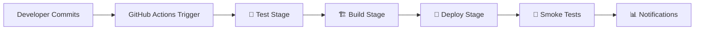

# 🚀 DevOps Pipeline Guide - Containerized Lambda Deployment

## 🎯 **Overview**

You have a **production-ready GitHub Actions CI/CD pipeline** that automatically builds and deploys your containerized Lambda functions when developers commit code.

---

## 🏗️ **Current Pipeline Architecture**



### **Pipeline Stages:**

1. **🧪 Test Stage**
   - Runs unit tests
   - Validates service structure
   - Checks code quality

2. **🏗️ Build Stage**
   - Builds Docker containers (parallel for all services)
   - Pushes to ECR with proper tagging
   - Uses build cache for faster builds

3. **🚀 Deploy Stage**
   - Updates Lambda functions with new container images
   - Waits for deployment completion
   - Environment-specific deployments

4. **🧪 Smoke Tests**
   - Validates each function after deployment
   - Service-specific test payloads
   - Automatic rollback on failure

5. **📊 Notifications**
   - Deployment status reporting
   - Success/failure notifications

---

## 🔧 **Setup Instructions**

### **1. GitHub Repository Setup**

Your repository is already configured with the pipeline. Just need to set up secrets:

```bash
# Required GitHub Secrets (Settings → Secrets and variables → Actions)
AWS_ACCESS_KEY_ID=your_aws_access_key
AWS_SECRET_ACCESS_KEY=your_aws_secret_key
```

### **2. AWS IAM User for CI/CD**

Create a dedicated IAM user for GitHub Actions:

```json
{
    "Version": "2012-10-17",
    "Statement": [
        {
            "Effect": "Allow",
            "Action": [
                "lambda:UpdateFunctionCode",
                "lambda:GetFunction",
                "lambda:InvokeFunction",
                "ecr:GetAuthorizationToken",
                "ecr:BatchCheckLayerAvailability",
                "ecr:GetDownloadUrlForLayer",
                "ecr:BatchGetImage",
                "ecr:PutImage",
                "ecr:InitiateLayerUpload",
                "ecr:UploadLayerPart",
                "ecr:CompleteLayerUpload"
            ],
            "Resource": "*"
        }
    ]
}
```

### **3. Branch Protection Rules**

Set up branch protection for `main`:
- Require pull request reviews
- Require status checks to pass
- Require branches to be up to date

---

## 🚀 **Developer Workflow**

### **Simple Developer Experience:**

```bash
# 1. Developer makes changes
git checkout -b feature/new-payment-logic
# ... make code changes ...

# 2. Commit and push
git add .
git commit -m "Add new payment validation logic"
git push origin feature/new-payment-logic

# 3. Create Pull Request
# → Pipeline runs tests automatically
# → Code review process
# → Merge to main

# 4. Automatic Deployment
# → Pipeline builds containers
# → Deploys to Lambda
# → Runs smoke tests
# → Notifies team
```

### **What Happens Automatically:**

1. **On Pull Request**: Tests run, no deployment
2. **On Merge to Main**: Full build → deploy → test cycle
3. **On Develop Branch**: Build containers, no deployment (staging ready)

---

## 📊 **Pipeline Features**

### **✅ Advanced Features Included:**

- **🔄 Parallel Builds**: All services build simultaneously
- **📦 Smart Caching**: Docker layer caching for faster builds
- **🏷️ Intelligent Tagging**: Git SHA + branch-based tags
- **🧪 Automated Testing**: Unit tests + smoke tests
- **🛡️ Environment Protection**: Production deployment controls
- **📊 Deployment Tracking**: Full visibility into deployments
- **⚡ Fast Feedback**: Quick failure detection

### **🎯 Benefits Over Jenkins:**

| Feature | GitHub Actions | Jenkins |
|---------|---------------|---------|
| **Setup Time** | ✅ Minutes | ❌ Hours/Days |
| **Maintenance** | ✅ Zero | ❌ High |
| **Git Integration** | ✅ Native | ❌ Plugins needed |
| **Scaling** | ✅ Automatic | ❌ Manual |
| **Cost** | ✅ Pay per use | ❌ Always running |
| **Security** | ✅ Built-in | ❌ Manual setup |

---

## 🔧 **Advanced Pipeline Enhancements**

### **1. Multi-Environment Support**

Add staging environment:

```yaml
# Add to workflow
deploy-staging:
  if: github.ref == 'refs/heads/develop'
  environment: staging
  # Deploy to staging Lambda functions
```

### **2. Rollback Capability**

```yaml
rollback:
  if: failure()
  steps:
    - name: Rollback on Failure
      run: |
        # Revert to previous image tag
        aws lambda update-function-code \
          --function-name $FUNCTION_NAME \
          --image-uri $ECR_REGISTRY/$ECR_REPOSITORY:previous
```

### **3. Performance Monitoring**

```yaml
performance-test:
  steps:
    - name: Performance Baseline
      run: |
        # Run load tests
        # Compare with baseline metrics
        # Alert if performance degrades
```

---

## 📈 **Monitoring & Observability**

### **Pipeline Monitoring:**

1. **GitHub Actions Dashboard**: Real-time pipeline status
2. **AWS CloudWatch**: Lambda execution metrics
3. **ECR Repository**: Container image history
4. **Deployment History**: Full audit trail

### **Key Metrics to Track:**

- **Build Time**: Container build duration
- **Deployment Time**: Lambda update duration
- **Test Success Rate**: Automated test results
- **Rollback Frequency**: Deployment stability

---

## 🛠️ **Troubleshooting Guide**

### **Common Issues:**

1. **Build Failures**
   ```bash
   # Check Docker build logs
   # Verify Dockerfile syntax
   # Check dependency versions
   ```

2. **Deployment Failures**
   ```bash
   # Verify AWS permissions
   # Check Lambda function exists
   # Validate ECR image URI
   ```

3. **Test Failures**
   ```bash
   # Check test payload format
   # Verify Lambda function response
   # Review CloudWatch logs
   ```

---

## 🎯 **Best Practices**

### **Code Organization:**
```
├── services/
│   ├── bank-account-setup/
│   ├── payment-processing/
│   └── subscription-manager/
├── tests/
├── scripts/
└── .github/workflows/
```

### **Commit Messages:**
```bash
feat: add new payment validation logic
fix: resolve bank account validation bug
docs: update API documentation
ci: improve pipeline performance
```

### **Branch Strategy:**
- `main`: Production deployments
- `develop`: Staging deployments  
- `feature/*`: Development branches

---

## 🚀 **Getting Started**

### **Immediate Actions:**

1. **✅ Set up GitHub Secrets** (AWS credentials)
2. **✅ Test the pipeline** (make a small change and commit)
3. **✅ Configure branch protection** (require PR reviews)
4. **✅ Set up notifications** (Slack/email integration)

### **Your Pipeline is Ready!**

Just commit code to `main` branch and watch the magic happen:

```bash
git add .
git commit -m "feat: improve payment processing logic"
git push origin main
# → Pipeline automatically builds and deploys! 🚀
```

---

## 🎉 **Summary**

**You have a production-ready DevOps pipeline that:**

✅ **Automatically builds** containerized Lambda functions  
✅ **Deploys on every commit** to main branch  
✅ **Runs comprehensive tests** before and after deployment  
✅ **Provides fast feedback** to developers  
✅ **Scales automatically** with your team growth  
✅ **Costs less** than maintaining Jenkins infrastructure  
✅ **Integrates natively** with your Git workflow  

**No Jenkins needed - GitHub Actions is the modern choice for your containerized Lambda deployment!** 🏆